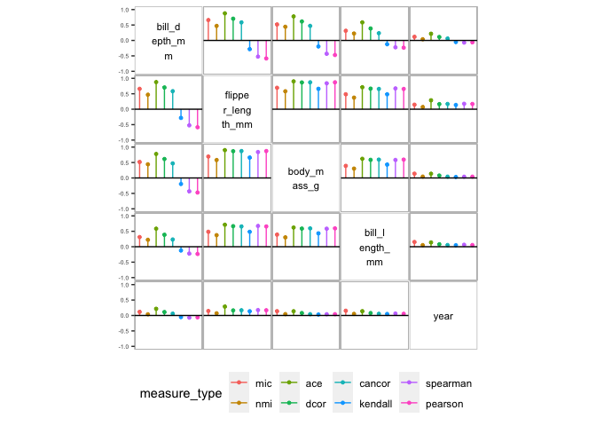

<!-- README.md is generated from README.Rmd. Please edit that file -->

# corVis

<!-- badges: start -->
<!-- badges: end -->

The goal of corVis is to visualise association and conditional
association. The conventional correlation matrix displays are extended
to include every variable pair, in order to visualise all pairwise
associations in the dataset. Display with multiple association measures
is introduced for a comparison of the measures. A conditional
association display is also introduced to explore the difference in
association at different levels of conditioning variable.

## Installation

You can install the development version of corVis from
[GitHub](https://github.com/) with:

``` r
# still in progress
# install.packages("devtools")
# devtools::install_github("chinwan16/corVis")
```

## Example 1: Pairwise display for every variable pair in a dataset

This is an example of an association measures display for every variable
pair in the dataset. We will use `penguins` dataset from
`palmerpenguins` package in R.

``` r
library(corVis)
# install.packages("palmerpenguins")
library(palmerpenguins)

penguins_df <- palmerpenguins::penguins

penguins_assoc <- calc_assoc(penguins_df)
plot_assoc_matrix(penguins_assoc)
```


## Example 2: Multiple measures display for comparison of association measures

This example shows a display of multiple association measures for all
the variable pairs. This display is useful in comparing the multiple
measures in order to reveal variable pairs with high difference among
the measures.

``` r
penguins_num <- dplyr::select(penguins_df,where(is.numeric))
penguins_compare <- calc_assoc_all(penguins_num)


plot_assoc_matrix(penguins_compare,
                  var_order = "default",
                  limits = c(-1,1))
```



## Example 3: Conditional association display

This example shows a conditional association display at different levels
of a conditioning variable (`species` in this case). This display is
useful in for exploring variable pairs with high difference in the
measure value at different levels of a conditioning variable.

``` r
penguins_cond <- calc_assoc(penguins_df, by="species")
plot_assoc_matrix(penguins_cond)
```


